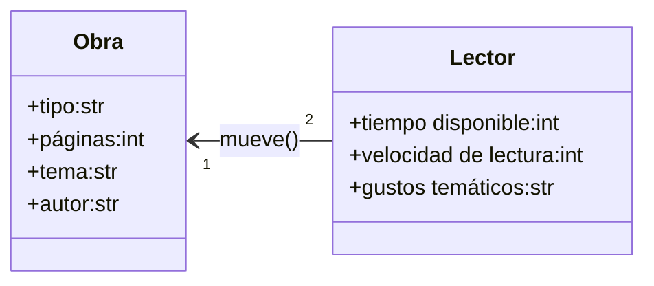

# POO-UNAL-2025-1-RETO-2
En este caso se elige el problema de elegir un libro para leer en el club de lectura a dónde voy a comer galletas saltinas y hablar sobre la vida mísma y cómics. (más data al DM)

