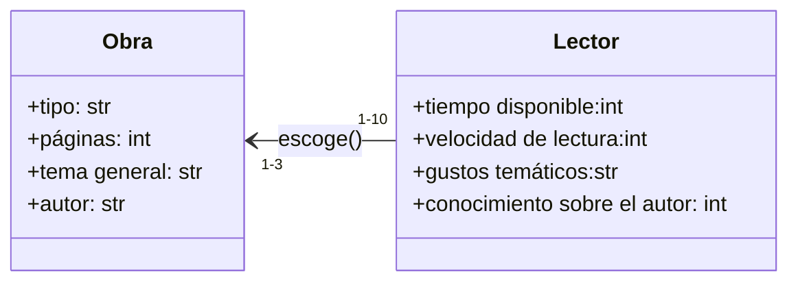

# POO-UNAL-2025-1-RETO-2
En este caso se elige el problema de elegir un libro para leer en el club de lectura, a la vez de encontrar temas que se podrían desarrollar a lo largo de la sesión.

En primero lugar se consideran las primeras relaciones al momento de escoger un libro para leer, modelado por las siguientes 2 clases:



En segundo lugar es posible observar que se manejan otras relaciones al momento de discusión de la obra

```mermaid
classDiagram
    direction U
    class Obra_leída{
        +tipo: str
        +temas: list
        +autor: str
        +personajes: list
        +fecha de escritura: int
        +lugar de escritura: str
        +intervalo temporal: int
    }
    class Personaje{
        +nombre: str
        +rol: str
        +edad: int
        +género: str
        +acciones: list
        +real: bool
        +comportamientos: list
    }
    class Lector_proponente_oponente{
        +páginas leídas: int
        +gustos temáticos:str
        +conocimiento sobre el autor: int
    }
    class Multimedia{
        +tipo: str
        +temas: str
        +autores: list
        +plataforma: str
        +relación con la obra: int
    }
    class Opinión{
        +opinión númerica: int
        +temas identificados: list
        +emociones involucradas: list
        +personajes involucrado: list
        +sucesos relacionados: list

    }
    class Discusión{
        +temas tratados: list
        +participantes: list

    }
    Lector_proponente_oponente"1-10" --> "1" Obra_leída : lee()
    Lector_proponente_oponente"1-10" --> "1" Opinión : opina()
    Lector_proponente_oponente"1-10" -->  Multimedia: consume()
    Obra_leída"1-10" -->  "1-"Personaje: posee()
    Lector_proponente_oponente"1-10" -->  Discusión: participar()
    Discusión --> Obra_leída: referenciar()